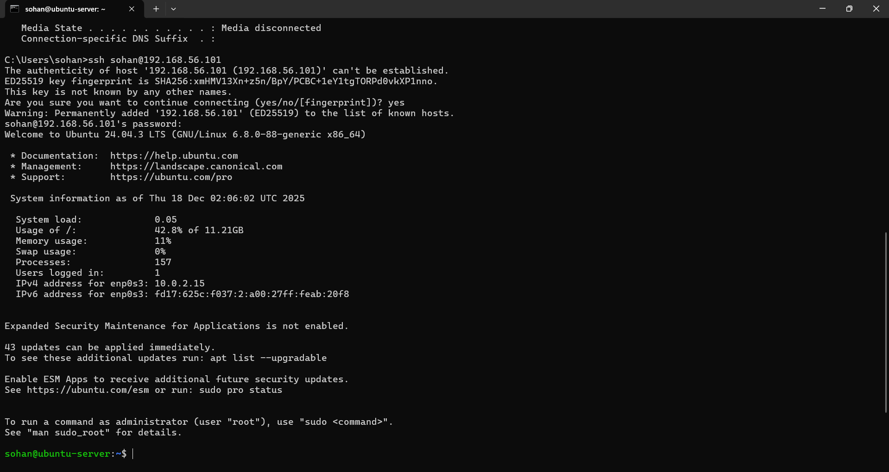
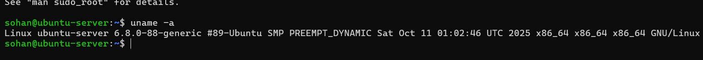
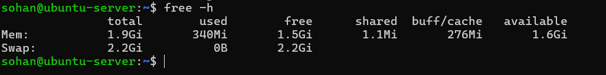
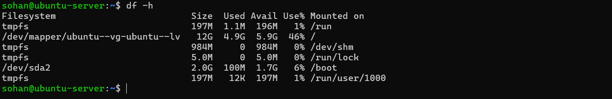
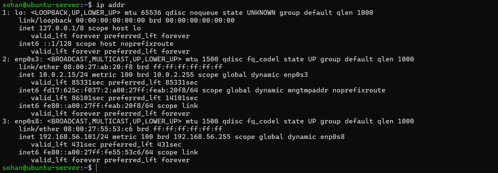

# Week 1: System Planning and Architecture Design
### Module: Operating Systems / Systems Administration
### Student:   Sohan Giri  
### StudentID: A00032373
### Date: 2025/11/05

---

## 1. Introduction

The purpose of Week 1 was to design and plan the system architecture used throughout this coursework. This phase focused on selecting an appropriate Linux server distribution, defining a secure and ethical network configuration, and justifying the workstation environment used for remote administration. Establishing a well-structured architecture at this stage is critical, as it forms the foundation for later security hardening, performance testing, and system evaluation tasks.

---

## 2. System Architecture Overview

### 2.1 Architecture Description

The system follows a dual-system client–server architecture consisting of a workstation and a server. The workstation is the host PC, which provides the administrative interface for managing the server. The server runs Ubuntu Server LTS in a headless configuration within VirtualBox and does not include a graphical user interface.

All administrative tasks are performed remotely via Secure Shell (SSH) from the workstation to the server. This design enforces command-line proficiency and mirrors industry-standard practices used in cloud and data-centre environments. The use of virtualisation allows the server to be isolated from external networks while still enabling secure communication between the workstation and server.

### 2.2 System Architecture Diagram

Figure 1: Dual-system architecture using a host PC and Ubuntu Server LTS (headless).

The diagram illustrates the separation of responsibilities between the workstation and the server. The workstation initiates SSH connections, runs monitoring scripts, and manages the GitHub Pages technical journal. The Ubuntu Server accepts SSH connections, runs Linux services, and enforces security controls. Both systems communicate through an isolated VirtualBox virtual network.

## 3. Distribution Selection and Justification

### 3.1 Selected Server Distribution

Chosen Distribution: Ubuntu Server LTS
Ubuntu Server LTS was selected as the server operating system due to its strong balance of stability, security, and long-term support. The Long-Term Support (LTS) release model provides five years of security updates and maintenance, making it suitable for production-style environments.
Ubuntu Server includes native support for widely used security tools such as UFW (Uncomplicated Firewall), AppArmor, fail2ban, and automatic security updates. These tools align directly with the security requirements of the coursework and allow for systematic implementation of industry-standard security controls. In addition, Ubuntu Server benefits from extensive official documentation and a large community, which supports efficient troubleshooting and learning.

### 3.2 Comparison with Alternative Distributions

Feature	Ubuntu Server LTS	Debian	Rocky Linux
Release model	LTS (5 years)	Very conservative	Enterprise-focused
Ease of use	High	Medium	Medium
Security frameworks	AppArmor	AppArmor	SELinux
Community support	Very large	Large	Growing

## 4. Workstation Configuration Decision

### 4.1 Selected Workstation Option

Selected Option: Option B – Host PC
The host PC was selected as the workstation for administering the Ubuntu Server. This approach avoids the overhead of running an additional desktop virtual machine and allows system resources to be focused on the server itself. The host PC already provides a reliable SSH client and access to development tools such as Git, making it well suited for remote administration and journal management.
Using the host PC as the workstation also reflects professional practice, where system administrators and DevOps engineers commonly manage remote servers from their personal or corporate machines rather than from dedicated management servers.

## 5. Network Configuration

### 5.1 Virtual Network Setup

The workstation and server communicate through an isolated VirtualBox virtual network. This network configuration enables secure SSH communication while ensuring that all security testing and scanning activities remain confined to the local environment.

The use of an isolated network ensures ethical compliance with university policies by preventing interaction with external or university networks during security testing. This configuration also reduces the system’s attack surface and provides a controlled environment for experimenting with firewall rules, intrusion detection mechanisms, and performance testing.

## 6. Server System Specification (CLI Evidence)

### 6.0 Remote SSH Access Verification

This screenshot demonstrates a successful SSH connection from the Windows host PC to the Ubuntu Server using a non-root user account. The presence of the “sohan@ubuntu-server” prompt confirms authenticated remote access and correct system context. All subsequent administrative commands were executed within this SSH session, enforcing command-line-only administration.

### 6.1 System Information Commands

**Command: uname -a**

The `uname -a` command displays kernel version, system architecture, and operating system details. This information confirms the underlying Linux kernel and platform used for the server, which is relevant when analysing performance and security behaviour in later phases.

**Command: free -h**

The free -h command was used to display system memory usage in a human-readable format. The output shows that the server has approximately 1.9 GiB of total RAM, with 340 MiB currently in use and 1.5 GiB free at idle. The system also reports 2.2 GiB of swap space, which is currently unused.

This indicates that the server is lightly loaded at baseline and has sufficient available memory to support performance testing and workload execution in later phases of the coursework. These values establish a baseline for comparing memory consumption under different application workloads.

**Command: df -h**

The df -h command was used to display disk space usage across all mounted file systems in a human-readable format. The output shows that the main root file system (/dev/mapper/ubuntu--vg-ubuntu--lv) has a total capacity of 12 GB, with approximately 4.9 GB used and 5.9 GB available, resulting in 46% utilisation.
This indicates that sufficient disk space is available for installing applications, storing logs, and performing performance testing in later phases of the coursework. Temporary file systems such as tmpfs are also shown, which are memory-backed and used for runtime data rather than persistent storage.

**Command: ip addr**

The ip addr command was used to display all network interfaces and their assigned IP addresses on the Ubuntu Server. The output shows multiple interfaces, including the loopback interface (lo) and two active Ethernet interfaces.
The interface enp0s3 is assigned the IP address 10.0.2.15/24, which corresponds to the NAT adapter. This interface provides outbound internet connectivity for tasks such as system updates and package installation.
The interface enp0s8 is assigned the IP address 192.168.56.101/24, which corresponds to the Host-only adapter. This interface is used for secure SSH administration, monitoring, and security testing from the Windows host PC.
This dual-network configuration separates internet access from administrative access, improving security and ensuring that all security testing is confined to the isolated virtual network.

**Command: lsb_release -a**

The lsb_release -a command was used to display detailed information about the Linux distribution running on the server. The output confirms that the system is running Ubuntu 24.04.3 LTS.
Using a Long-Term Support (LTS) release ensures extended security updates and system stability, which is essential for server environments. This version information is also important when referencing official documentation, applying security updates, and evaluating compatibility with security and monitoring tools used in later phases of the coursework.

## 7. Administrative Constraints
This is the list of several administrative constraints that were applied from the beginning of the coursework:
•	The server operates in a headless configuration with no graphical interface.
•	All server administration is performed exclusively via SSH.
•	No graphical management tools are used on the server.
•	Routine use of the VirtualBox console is avoided.
These constraints ensure alignment with professional server administration standards and reinforce command-line proficiency.

## 8. Reflection
This week highlighted the importance of careful system planning and architectural decision-making. Selecting an appropriate server distribution and workstation environment required balancing usability, security, and performance considerations. Designing the architecture in advance provided a clear roadmap for subsequent weeks, particularly for security hardening and performance evaluation tasks.

## 9. References 
[1] Ubuntu, Ubuntu Server Documentation. 
Link: https://ubuntu.com/server/docs. 
[2] Wikipedia, Deployment Diagram. 
Link: https://en.wikipedia.org/wiki/Deployment_diagram. 
[3]GeeksforGeeks, How to Draw Architecture Diagrams 
Link: https://www.geeksforgeeks.org/how-to-draw-architecture-diagrams/

