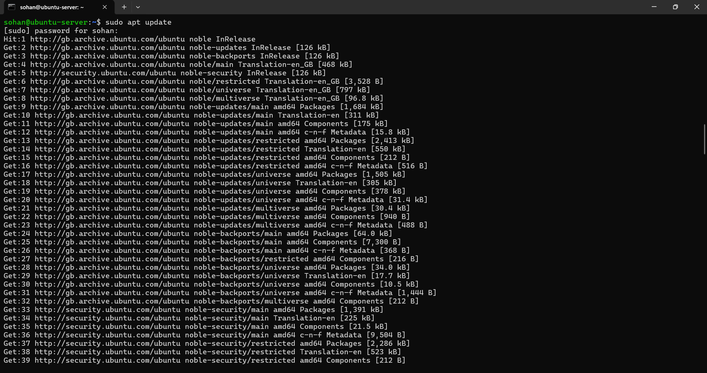
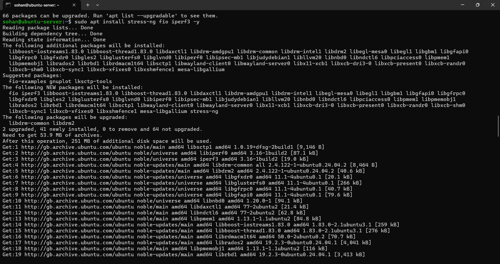

# Week 3: Application Selection for Performance Testing  
### Module: Operating Systems / Systems Administration  
### Student: Sohan Giri  
### Student ID: A00032373  
### Date: 2025-11-19  

---

## 1. Introduction

The purpose of Week 3 was to select a range of applications representing different workload types in order to evaluate operating system performance under varying conditions. Each application was chosen to stress specific system resources, including CPU, memory, disk I/O, and network performance. This structured selection enables systematic performance analysis and supports later optimisation and operating system trade-off evaluation.

---

## 2. Application Selection Strategy

Applications were selected based on the following criteria:

- Each application targets a distinct system resource
- Tools are lightweight and suitable for a virtualised server environment
- Applications are commonly used in Linux server performance analysis
- Results are measurable, repeatable, and suitable for quantitative comparison

This approach ensures that performance testing remains controlled, ethical, and representative of real-world server workloads while avoiding unnecessary system complexity.

---

## 3. Application Selection Matrix

| Application        | Workload Type        | Primary Resource Stressed | Justification                                                                 |
|--------------------|----------------------|---------------------------|--------------------------------------------------------------------------------|
| stress-ng          | CPU-intensive        | CPU                       | Generates controlled CPU load to analyse scheduler behaviour and CPU utilisation |
| stress-ng          | Memory-intensive     | RAM                       | Allocates memory to test memory pressure and observe swap behaviour             |
| fio                | I/O-intensive        | Disk I/O                  | Measures disk read/write throughput and I/O latency                             |
| iperf3             | Network-intensive    | Network                   | Measures network throughput and latency between host and server                 |
| openssh-server     | Server workload      | CPU, Network              | Represents a real-world server service handling authenticated remote connections |

Including both synthetic benchmarking tools and a real server service allows comparison between controlled stress testing and realistic operational workloads.

---

## 4. Installation Documentation (via SSH)

### 4.1 Updating Package Lists

The `sudo apt update` command refreshes the local package index by retrieving the latest package information from configured Ubuntu repositories. This ensures that all installed software uses current package versions and dependencies, reducing the risk of compatibility or security issues.

### 4.2 Installing Performance Testing Tools

The following command installs the selected performance testing tools:

- `stress-ng` for generating CPU and memory workloads  
- `fio` for benchmarking disk I/O performance  
- `iperf3` for measuring network throughput and latency  

The `-y` flag enables non-interactive installation while maintaining administrative control through `sudo`. Installing these tools during this phase prepares the system for later testing without executing workloads prematurely.

---

## 5. Expected Resource Profiles

| Application           | Expected CPU Impact | Expected Memory Impact | Expected Disk / Network Impact        |
|-----------------------|--------------------|------------------------|---------------------------------------|
| stress-ng (CPU)       | High               | Low                    | Minimal                               |
| stress-ng (Memory)    | Moderate           | High                   | Minimal                               |
| fio                   | Low                | Low                    | High disk I/O                         |
| iperf3                | Low                | Low                    | High network throughput               |
| SSH service           | Low                | Low                    | Moderate network activity             |

These expected profiles establish hypotheses that will be validated through measured performance data during later testing phases.

---

## 6. Monitoring Strategy

Performance metrics will be collected remotely from the workstation using SSH-based commands and scripts to minimise monitoring overhead on the server.

### 6.1 Monitoring Tools

Planned monitoring commands include:

- `top` / `htop` – real-time CPU and memory usage  
- `vmstat` – memory, process, and scheduling statistics  
- `iostat` – disk I/O performance and wait times  
- `ss` – network socket and connection statistics  
- `ping` – network latency measurement  

### 6.2 Data Collection Approach

- Metrics will be collected during baseline (idle) and load conditions  
- Sampling will occur at regular, consistent intervals  
- Results will be recorded in structured tables and visualised using charts and graphs  

While frequent sampling improves accuracy, it may introduce minor overhead. For this reason, monitoring is conducted remotely to balance observability with system performance.

---

## 7. Reflection

This week demonstrated the importance of selecting appropriate workloads to evaluate operating system performance effectively. By choosing applications that isolate specific system resources, it becomes easier to identify performance bottlenecks and analyse trade-offs between resource utilisation, system responsiveness, and applied security controls.

Combining synthetic stress tools with a real server service provides a more complete understanding of operating system behaviour under both controlled and realistic conditions, forming a strong foundation for performance analysis and optimisation in later weeks.

---

## 8. References

[1] Linux Man Pages, *stress-ng*. [Online]. Available: https://manpages.ubuntu.com/manpages/stress-ng.html. Accessed: 19-Nov-2025.  

[2] Linux Man Pages, *fio*. [Online]. Available: https://manpages.ubuntu.com/manpages/fio.html. Accessed: 19-Nov-2025.  

[3] ESnet, *iperf3 Documentation*. [Online]. Available: https://iperf.fr/iperf-doc.php. Accessed: 19-Nov-2025.
