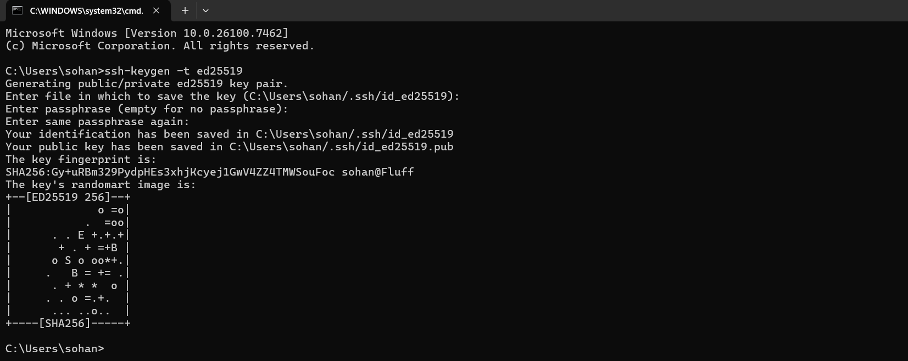
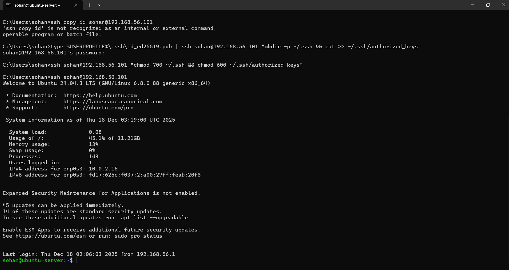
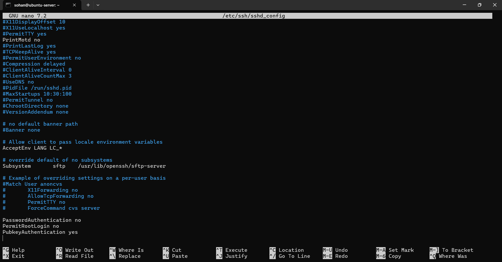
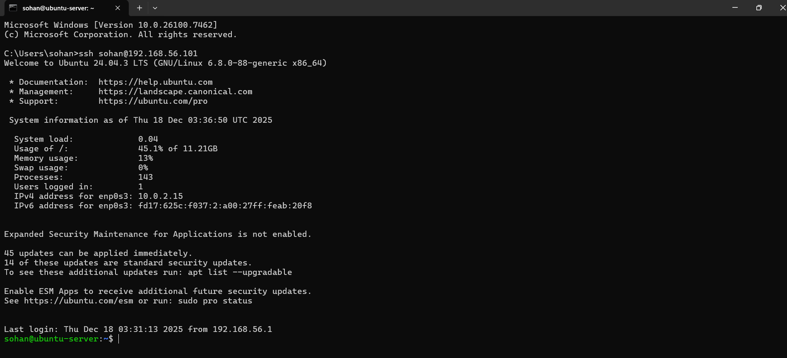
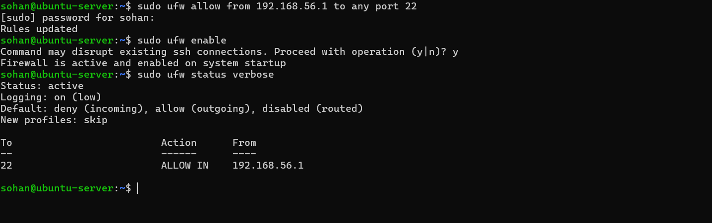
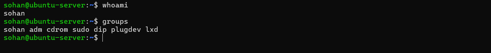

Week 4 – Initial System Configuration and Security Implementation

1. Introduction
The purpose of Week 4 was to deploy the Ubuntu Server and implement foundational security controls. This phase focused on securing remote access, configuring a firewall, and enforcing proper user privilege management. All configuration changes were performed remotely via SSH in accordance with the coursework’s administrative constraints.

2. SSH Key-Based Authentication
2.1 Generating SSH Keys on the Workstation (Windows Host PC)

**Figure 1:** Generation of an ED25519 SSH key pair on the Windows host workstation. An Ed25519 SSH key pair was generated on the Windows host PC using the ssh-keygen utility. The default key storage location was used to ensure compatibility with standard SSH tools. Key-based authentication was selected to replace password-based login, providing stronger protection against brute-force attacks while maintaining usability within a controlled virtual environment.
2.2 Installing the Public SSH Key on the Server
 

**Figure 2:** Installation of the SSH public key on the Ubuntu Server using an alternative manual method.
The ssh-copy-id utility was not available in the Windows Command Prompt environment. As an alternative, the public SSH key was manually installed on the Ubuntu Server by appending it to the ~/.ssh/authorized_keys file over an SSH connection. Secure file permissions were then applied to the SSH configuration directory and the authorized_keys file in accordance with OpenSSH security requirements. A subsequent SSH connection was established without a password prompt, confirming that key-based authentication was successfully configured.

2.3 Disabling Password Authentication on the Server

**Figure 3:** Editing the SSH daemon configuration file (`sshd_config`) to harden authentication settings.

**Figure 4:** SSH configuration updated to disable password-based authentication.
Password-based SSH authentication and direct root login were disabled by explicitly configuring the SSH daemon. After restarting the SSH service, key-based authentication was verified to function correctly through a successful passwordless login. This hardening step significantly reduces the risk of brute-force and credential-based attacks while preserving secure remote administration.
3. Firewall Configuration (UFW)

**Figure 5:** UFW firewall enabled with SSH access restricted to the trusted workstation IP address.
Screenshot: UFW firewall configuration showing SSH access restricted to the trusted host PC IP address and the firewall enabled with a default deny policy for incoming traffic.
The Uncomplicated Firewall (UFW) was configured to restrict inbound SSH access so that connections are permitted only from the trusted workstation IP address on the Host-only network. The firewall was enabled with a default policy of denying all incoming connections while allowing outbound traffic. Verification of the rules confirmed that SSH (port 22) is the only permitted inbound service. This configuration significantly reduces the server’s attack surface while maintaining secure remote administration.

4. User Management and Privilege Control
4.1 Verifying Non-Root Administrative User

**Figure 6:** Verification of non-root user account membership in the sudo group.
The whoami command confirms that the current SSH session is operating under the non-root user account sohan. The groups command shows that this user is a member of the sudo group, allowing administrative tasks to be performed with elevated privileges when required. This configuration enforces the principle of least privilege by preventing direct root access while maintaining controlled administrative capability.

4.2 Privilege Separation and Security Enforcement
Direct login as the root user was disabled within the SSH configuration. As a result, all administrative actions must be performed using sudo, ensuring that privileged operations are logged and attributable to an individual user account. This improves system accountability and reduces the security risks associated with unrestricted root access.

6. Configuration Summary
The following security controls were successfully implemented:
•	SSH key-based authentication
•	Password authentication disabled
•	Root login disabled
•	UFW firewall enabled
•	SSH restricted to a single trusted IP
•	Non-root administrative user enforced
These controls establish a secure baseline for further security hardening and monitoring.

7. Reflection
This week demonstrated how small configuration changes can significantly improve system security. Implementing SSH hardening and firewall restrictions reduced the system’s attack surface while maintaining full administrative functionality. This phase highlighted the trade-off between accessibility and security and reinforced the importance of careful configuration verification.

8. References 
[1] Ubuntu, OpenSSH Server. [Online]. Available: https://ubuntu.com/server/docs/service-openssh
[2] Ubuntu, Uncomplicated Firewall (UFW). [Online]. Available: https://help.ubuntu.com/community/UFW

