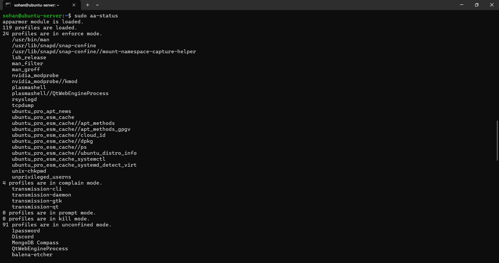
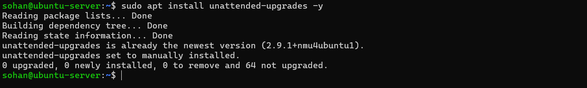
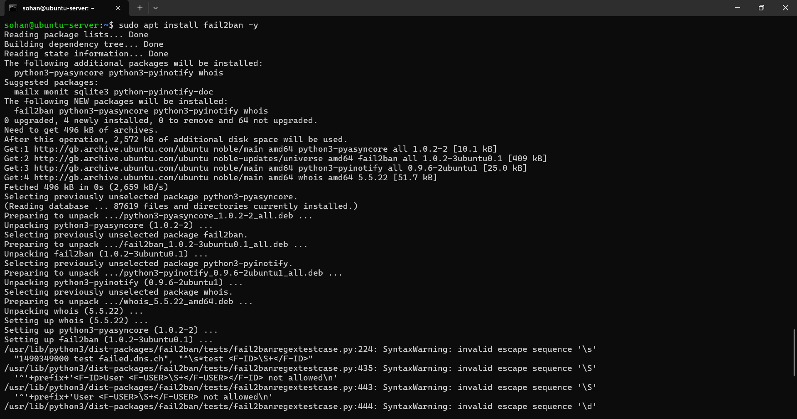
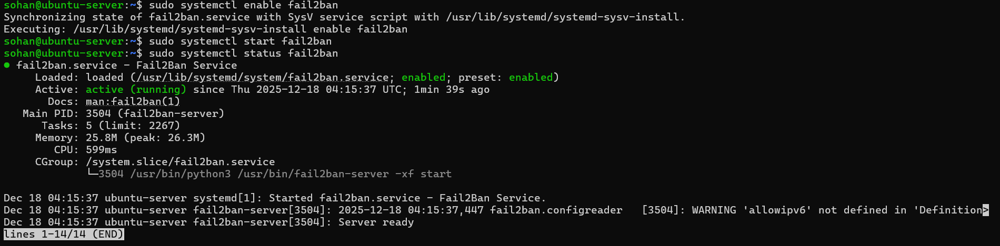
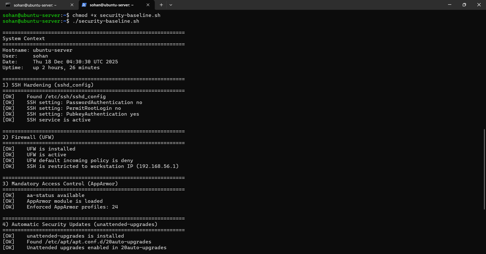
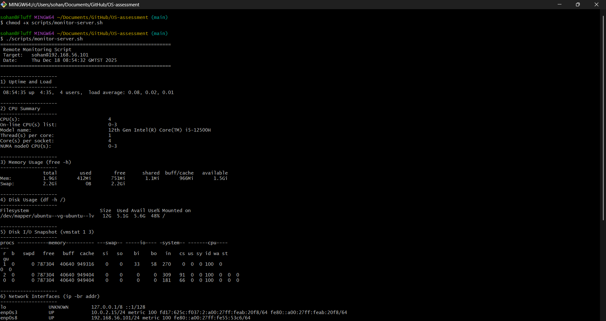

Week 5 – Advanced Security and Monitoring Infrastructure

1. Introduction
The purpose of Week 5 was to implement advanced security controls and establish automated monitoring and verification mechanisms. This phase builds upon the secure baseline established in Week 4 by adding mandatory access control, intrusion prevention, automatic security updates, and scripted verification of system security and performance.

2. Mandatory Access Control (AppArmor)
2.1 Verifying AppArmor Status

**Figure 1:** Output of `aa-status` confirming that AppArmor is loaded and multiple profiles are enforced on the Ubuntu Server.
The aa-status command was used to verify the operational status of AppArmor on the Ubuntu Server. The output confirms that the AppArmor kernel module is loaded and active, with multiple security profiles enforced. Enforced profiles restrict applications to predefined access rules, limiting the resources they can access and reducing the potential impact of compromised processes.
The presence of profiles in enforce mode indicates that AppArmor policies are actively preventing unauthorised actions, while profiles in complain mode allow monitoring and logging without blocking behaviour. This demonstrates that mandatory access control is enabled and functioning as part of a defence-in-depth security strategy.
2.2 Example AppArmor Profile Inspection

**Figure 2:** Inspection of enforced AppArmor profiles, demonstrating mandatory access control in operation.
The aa-status --enforced command was used to quantify the number of AppArmor profiles actively enforcing security policies on the system. The output indicates that 24 profiles are operating in enforce mode, meaning that AppArmor is actively restricting application behaviour rather than merely monitoring it. This confirms that mandatory access control is fully operational and contributes to a defence-in-depth security model.

3. Automatic Security Updates
3.1 Installing Unattended Upgrades

**Figure 3:** Verification that the unattended-upgrades package is installed and up to date, enabling automatic security updates.
The `unattended-upgrades` package was already present and up to date on the system; however, manual configuration was required to enable automatic installation of security updates.

4. Intrusion Prevention with fail2ban
4.1 Installing fail2ban

**Figure 4:** Installation of the fail2ban intrusion prevention system on the Ubuntu Server.
The fail2ban service was installed

4.2 Verifying fail2ban Operation

**Figure 5:** fail2ban service running and actively monitoring authentication logs for suspicious behaviour. 
The fail2ban service was installed, enabled, and verified to be actively running on the system. The service continuously monitors authentication logs and enforces temporary bans on IP addresses that exhibit suspicious behaviour, such as repeated failed login attempts. This provides real-time protection against brute-force attacks and complements existing SSH hardening and firewall restrictions. Minor configuration warnings reported during startup do not affect the runtime operation of the service.

5. Security Baseline Verification Script
5.1 Purpose
The purpose of this script is to automatically verify that the mandatory security controls implemented in Weeks 4 and 5 are correctly configured and still active. Automating verification reduces configuration drift and provides repeatable evidence of the server’s security posture.
5.2 Script Overview
The script performs automated checks for the following controls:
•	SSH hardening
o	Password authentication disabled
o	Root login disabled
o	Key-based authentication enabled
•	Firewall configuration
o	UFW enabled and active
o	Default incoming policy set to deny
o	SSH access restricted to the trusted workstation IP
•	Mandatory access control
o	AppArmor enabled with enforced profiles
•	Automatic security updates
o	unattended-upgrades installed and enabled
•	Intrusion prevention
o	fail2ban service running
o	SSH jail available
•	Service exposure
o	Verification that SSH is listening on the expected port

5.3 Execution Evidence

**Figure 6:** Execution of the security baseline verification script confirming SSH hardening, firewall configuration, AppArmor enforcement, automatic updates, and fail2ban operation.
5.4 Source Code Availability
The full implementation of the security baseline verification script is maintained in the project’s GitHub repository to ensure clarity, maintainability, and version control.
Repository link:
https://github.com/sohan0911/OS-assessment/blob/main/scripts/security-baseline.sh

6. Remote Monitoring Script
6.1 Purpose
A remote monitoring script (monitor-server.sh) was created to collect performance metrics from the Ubuntu Server over SSH. Running monitoring from the workstation minimises overhead on the server and supports consistent data collection during later workload testing.

6.2 Metrics Collected
The script collects the following metrics from the server:
•	System uptime and load averages
•	CPU configuration summary
•	Memory utilisation
•	Disk utilisation of the root filesystem (/)
•	Disk I/O snapshot
•	Network interface status and IP addressing
•	Top CPU- and memory-consuming processes

6.3 Execution Evidence

**Figure 7:** Execution of the remote monitoring script from the workstation, retrieving live performance metrics from the Ubuntu Server via SSH.
The script connects to the server using key-based SSH authentication and runs a set of lightweight system commands to gather performance and configuration metrics. This approach mirrors professional remote administration practices and provides repeatable evidence for baseline and load-testing comparisons.
6.4 Source Code Availability
The full script is stored in the GitHub repository for version control and transparency:
/scripts/monitor-server.sh
Repository link:
https://github.com/sohan0911/OS-assessment/blob/main/scripts/monitor-server.sh

7. Reflection
Week 5 demonstrated the importance of layered security and automation. Implementing AppArmor, automatic updates, and fail2ban added defence-in-depth, while scripting reduced reliance on manual checks. These controls reflect real-world Linux server security practices and prepare the system for auditing and performance evaluation in later phases.

8. References 
[1] Ubuntu, AppArmor Documentation. [Online]. Available: https://ubuntu.com/server/docs/security-apparmor
[2] Ubuntu, Unattended Upgrades. [Online]. Available: https://help.ubuntu.com/community/AutomaticSecurityUpdates
[3] fail2ban, Official Documentation. [Online]. Available: https://www.fail2ban.org/wiki

