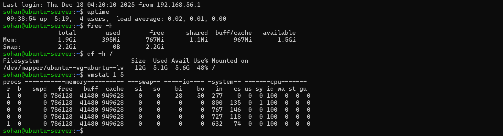
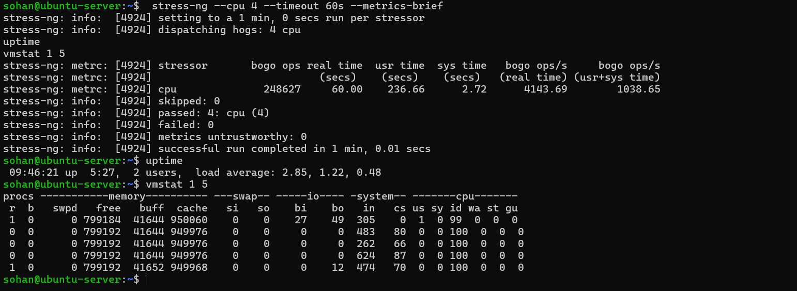
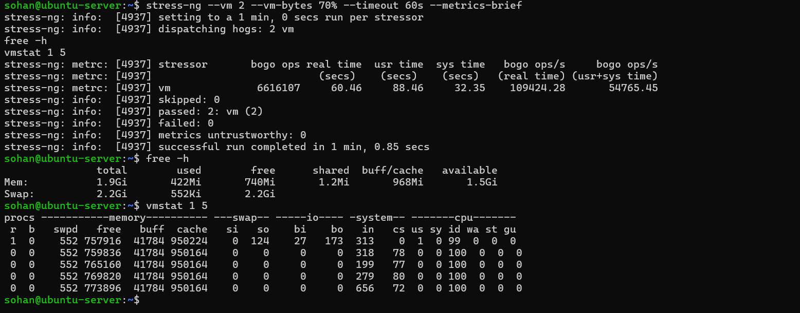
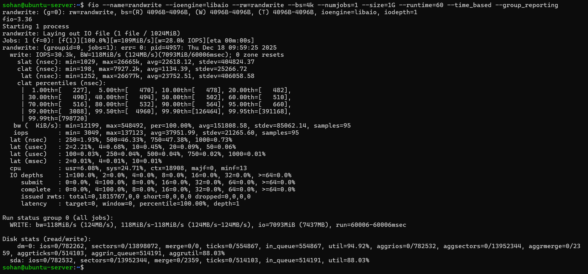
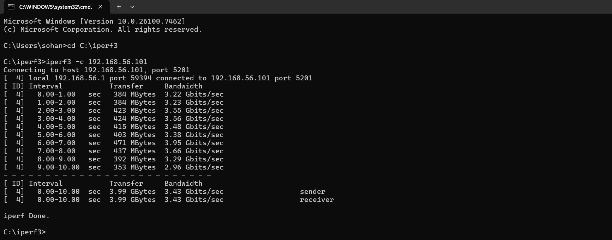

Week 6 – Performance Evaluation and Analysis
1. Introduction

This week focused on evaluating the performance of the Ubuntu Server under different workload conditions. Baseline measurements were first collected to establish normal system behaviour under idle conditions. The system was then subjected to controlled CPU, memory, disk I/O, and network stress tests. The results were analysed to identify bottlenecks, assess system stability, and understand operating system behaviour under load.

2. Baseline Performance Measurements

Baseline performance measurements were collected while the server was idle to provide a reference point for comparison with stress testing results.

2.1 Commands Used
uptime
free -h
df -h /
vmstat 1 5

2.2 Baseline Results

The baseline results show a low system load, minimal memory usage, no swap utilisation, and moderate disk usage. CPU idle time remained high, indicating that the system was largely unused at the time of measurement.

Figure 6.1: Baseline system performance metrics collected on the Ubuntu Server under idle conditions.

3. CPU Performance Testing
3.1 Methodology

CPU stress testing was performed using stress-ng to evaluate processor behaviour under sustained load. Four CPU workers were executed for 60 seconds to fully utilise the available CPU cores.

3.2 Command Used
stress-ng --cpu 4 --timeout 60s --metrics-brief

3.3 Results and Analysis

During the test, system load increased significantly, with the one-minute load average reaching approximately 2.85. CPU idle time dropped close to zero, confirming that all available CPU resources were being utilised. The system remained stable throughout the test and returned to idle conditions immediately after completion.

Figure 6.2: CPU utilisation and system load during stress-ng CPU testing.

4. Memory Performance Testing
4.1 Methodology

Memory stress testing was conducted using stress-ng with two virtual memory workers configured to allocate 70% of available system memory for 60 seconds.

4.2 Command Used
stress-ng --vm 2 --vm-bytes 70% --timeout 60s --metrics-brief

4.3 Results and Analysis

Memory usage increased from approximately 395 MiB at baseline to over 420 MiB during the test. Minimal swap usage was observed, indicating that the system had sufficient physical memory. The system remained responsive and stable throughout the test.

Figure 6.3: Memory utilisation during stress-ng memory workload.

5. Disk I/O Performance Testing
5.1 Methodology

Disk I/O performance was evaluated using fio to simulate a random write workload. A 4 KB block size was selected to reflect typical filesystem access patterns.

5.2 Command Used
fio --name=randwrite \
    --ioengine=libaio \
    --rw=randwrite \
    --bs=4k \
    --numjobs=1 \
    --size=1G \
    --runtime=60 \
    --time_based \
    --group_reporting

5.3 Results and Analysis

The disk achieved a sustained write throughput of approximately 118 MiB/s with over 30,000 IOPS. Disk utilisation exceeded 88%, indicating that storage became the primary bottleneck under load. Despite high utilisation, the system remained stable.

Figure 6.4: fio random write benchmark results showing disk throughput and latency.

6. Network Performance Testing
6.1 Methodology

Network performance was measured using iperf3 between the Windows host workstation and the Ubuntu Server over the isolated VirtualBox host-only network.

6.2 Commands Used

Server (Ubuntu):

iperf3 -s

Client (Windows):

iperf3 -c 192.168.56.101

6.3 Results and Analysis

The test achieved a sustained throughput of approximately 3.43 Gbit/s over a 10-second interval. The results demonstrate excellent network performance with stable throughput and no packet loss, confirming that the virtual network is not a limiting factor.

Figure 6.5: iperf3 network throughput results between the workstation and Ubuntu Server.

7. Performance Comparison Summary
Metric	Baseline	CPU Stress	Memory Stress	Disk I/O Stress	Network Test
Load average (1 min)	0.02	~2.85	Low	Low	N/A
Memory usage	395 MiB	~400 MiB	~422 MiB	~420 MiB	~400 MiB
Swap usage	0 B	0 B	~552 KiB	0 B	0 B
Disk throughput	Idle	Idle	Idle	~118 MiB/s	Idle
Network throughput	Idle	Idle	Idle	Idle	~3.43 Gbit/s
System stability	Stable	Stable	Stable	Stable	Stable
8. Discussion

The system demonstrated predictable and stable behaviour across all tests. CPU and memory resources scaled effectively under load, while disk I/O was identified as the primary performance constraint. Network performance exceeded requirements for administrative and monitoring tasks, confirming the suitability of the virtualised environment.

9. Conclusion

Week 6 successfully demonstrated systematic performance evaluation of an Ubuntu Server using industry-standard benchmarking tools. The results highlight the importance of balancing compute, memory, storage, and network resources when designing and evaluating server systems.