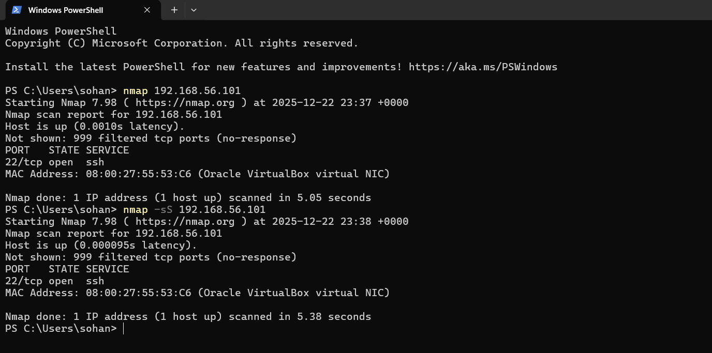
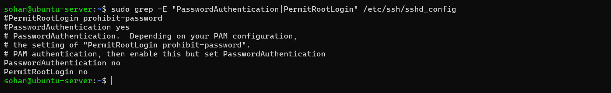
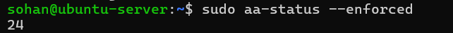
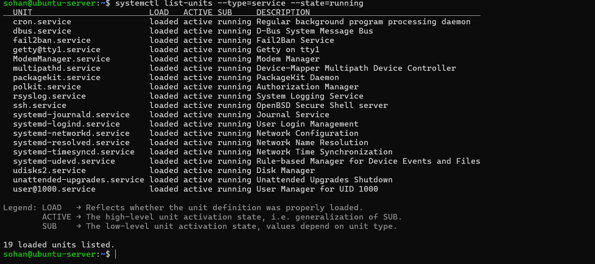

# Week 7: Security Audit and System Evaluation  
### Module: Operating Systems / Systems Administration  
### Student: Sohan Giri  
### Student ID: A00032373  
### Date: 2025-12-22  

---

## 1. Introduction

The purpose of Week 7 was to conduct a comprehensive security audit and final system evaluation of the Ubuntu Server. This phase focused on verifying that the security controls implemented in earlier weeks remained active, correctly configured, and effective. Rather than introducing additional hardening measures, the emphasis was placed on auditing, validation, and critical evaluation using industry-standard tools.

The audit was performed entirely via SSH from the workstation and restricted to the isolated VirtualBox Host-only network, ensuring ethical compliance and alignment with professional system administration practices.

---

## 2. Security Audit Methodology

A layered auditing approach was adopted combining automated scanning tools and manual verification. The audit focused on the following areas:

- System hardening and configuration compliance  
- Network exposure and firewall effectiveness  
- SSH authentication and access control  
- Mandatory access control enforcement  
- Running service evaluation and justification  
- Identification of residual risks and trade-offs  

This approach ensures that security decisions are evidence-based and proportionate to the system’s operational context.

---

## 3. System Hardening Audit with Lynis

### 3.1 Lynis Scan Execution

**Figure 7.1:** Lynis security audit summary showing a hardening index score of 60.

The Lynis audit tool was used to perform a comprehensive security assessment of the Ubuntu Server. The scan evaluated system configuration, installed software, network services, access control mechanisms, and security policies.

The audit produced a **hardening index score of 60**, based on 257 tests performed. This score indicates a moderately hardened system appropriate for a headless Linux server operating in a controlled virtual environment.

---

### 3.2 Lynis Findings and Interpretation

The audit confirmed that several key security controls were correctly implemented, including:

- Active host-based firewall  
- Hardened SSH configuration  
- Mandatory access control using AppArmor  
- Automatic security updates  
- Minimal installed services  

The score reflects a balanced approach to security rather than aggressive enterprise-level hardening, which would be unnecessary for the scope and environment of this system.

---

## 4. Analysis of Lynis Warnings and Unimplemented Recommendations

The Lynis audit identified several informational warnings and optional recommendations. These were reviewed individually, and decisions were made based on risk exposure, system purpose, and operational trade-offs.

### 4.1 Malware Scanner Not Installed

Lynis reported that no malware scanning software was installed on the system. This was assessed as acceptable because the server operates within an isolated VirtualBox Host-only network and does not process external file uploads, email traffic, or shared user content. Installing a malware scanner would introduce additional CPU and disk overhead with minimal security benefit in this environment.

### 4.2 DNSSEC Support Status Unknown

The audit reported DNSSEC support as unknown for the local resolver. The server does not provide DNS services and relies on `systemd-resolved` for basic name resolution. Enabling DNSSEC was deemed unnecessary, as it would not significantly improve security for a server that is not exposed to external DNS-based threats.

### 4.3 ARP Monitoring Software Not Present

No ARP monitoring software was detected. This was considered acceptable because the system operates on a single-host virtual network with no untrusted devices. The risk of ARP spoofing within this environment is negligible.

### 4.4 SSH Hardening Suggestions

Lynis identified several SSH-related suggestions, including limiting authentication attempts, restricting SSH forwarding features, and explicitly defining allowed users or groups. Core SSH security controls such as disabling root login, enforcing strict file permissions, and disabling password authentication were already correctly implemented. Additional restrictions were not applied to avoid unnecessary complexity and potential usability issues, as firewall rules and fail2ban already provide effective protection against brute-force attacks.

These decisions reflect a considered balance between security, maintainability, and system reliability rather than indiscriminate hardening.

---

## 5. Network Security Assessment with nmap

### 5.1 nmap Scan Execution

**Figure 7.2:** nmap scan executed from the Windows workstation against the Ubuntu Server.

A network security scan was performed using nmap from the Windows host workstation to verify firewall effectiveness and service exposure. The scan was restricted to the isolated Host-only network in accordance with ethical guidelines.

---

### 5.2 nmap Results and Analysis

The scan confirmed that **only port 22 (SSH)** was open, with all other TCP ports filtered by the firewall. This verifies that the UFW firewall is correctly enforced and that no unnecessary services are exposed to the network.

Restricting network access to a single essential service significantly reduces the system’s attack surface and aligns with best practices for securing headless Linux servers.

---

## 6. SSH Security Verification

**Figure 7.3:** Verification of SSH hardening settings.

Manual verification confirmed that password-based SSH authentication and root login remain disabled. Key-based authentication is enforced, ensuring strong protection against brute-force and credential-based attacks. These controls demonstrate that secure remote administration remains correctly configured.

---

## 7. Mandatory Access Control Verification (AppArmor)

**Figure 7.4:** AppArmor status showing enforced security profiles.

AppArmor was verified to be active with multiple profiles operating in enforce mode. Mandatory access control limits the actions that applications can perform even if compromised, providing an additional containment layer beyond traditional discretionary permissions.

---

## 8. Service Audit and Justification

**Figure 7.5:** List of active system services.

A review of running services confirmed that only essential services are active. These include the OpenSSH server for remote administration, fail2ban for intrusion prevention, and core system services required for operating system functionality. No unnecessary services such as web servers or printer daemons were found to be running, confirming a minimal attack surface.

---

## 9. Residual Risk Assessment

Despite strong security controls, some residual risks remain unavoidable. These include potential kernel-level vulnerabilities, zero-day exploits, and risks associated with physical access to the host system. These risks are mitigated as far as reasonably possible through regular updates, network isolation, and layered security controls.

Complete risk elimination is not feasible; however, the current configuration significantly reduces both the likelihood and potential impact of compromise.

---

## 10. Overall System Evaluation

The final system demonstrates a well-balanced security configuration suitable for a headless Ubuntu Server. Security controls were implemented systematically, verified through auditing tools, and supported by manual inspection. Trade-offs between security, usability, and performance were carefully considered, resulting in a stable and defensible configuration.

This audit confirms that the operating system behaves as an integrated system where security mechanisms, resource management, and administrative practices must be aligned.

---

## 11. Reflection

Week 7 reinforced the importance of verification and critical evaluation in system administration. Implementing security controls alone is insufficient without auditing and validation. Tools such as Lynis and nmap provided objective evidence of system hardening, while manual inspection ensured that configuration intent matched actual behaviour.

This phase highlighted the need to balance security improvements against operational complexity and demonstrated how informed decision-making is central to professional system administration.

---

## 12. References

[1] CISOfy, *Lynis – Security Auditing Tool*. [Online]. Available: https://cisofy.com/lynis/. Accessed: 22-Dec-2025.  

[2] nmap, *Network Mapper Documentation*. [Online]. Available: https://nmap.org/docs.html. Accessed: 22-Dec-2025.  

[3] Ubuntu, *Ubuntu Server Security Documentation*. [Online]. Available: https://ubuntu.com/security. Accessed: 22-Dec-2025.
